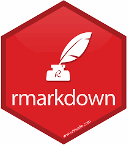

```{r setup, include=FALSE}
knitr::opts_chunk$set(message=FALSE,warning=FALSE, cache=TRUE)
```

In this workshop, we will cover four primary topics to get you started with R/RStudio. 

On day 1, we will cover:

1. Installing R/RStudio and setting up your workspace

2. Version control

On day 2, we will cover: 

3. Reporting R workflows

4. Basics of data cleaning, manipulation & plotting

# 1. Installing R/RStudio and setting up your workspace

```{r out.width='50%', out.extra='style="float:right; padding:10px"', echo = FALSE}

```

[R](http://www.r-project.org) is a free open-source programming language that can be used for statistical analysis, data-simulation, graphing, and lots of other stuff. Another free program is [RStudio](http://www.rstudio.com), that provides a nice graphic interface for R. Download R first, then download R-studio. Both can run on PCs, Macs or Linux.

# 2. Version Control

```{r out.width='20%', out.extra='style="float:right; padding:10px"', echo = FALSE}
knitr::include_graphics("images/GitHub_logo.png")
```

[R](http://www.r-project.org) is a free open-source programming language that can be used for statistical analysis, data-simulation, graphing, and lots of other stuff. Another free program is [RStudio](http://www.rstudio.com), that provides a nice graphic interface for R. Download R first, then download R-studio. Both can run on PCs, Macs or Linux.

# 3. Reporting R workflows

```{r out.width='20%', out.extra='style="float:right; padding:10px"', echo = FALSE}

```

[R](http://www.r-project.org) is a free open-source programming language that can be used for statistical analysis, data-simulation, graphing, and lots of other stuff. Another free program is [RStudio](http://www.rstudio.com), that provides a nice graphic interface for R. Download R first, then download R-studio. Both can run on PCs, Macs or Linux.

# 4. Basics of data cleaning, manipulation & plotting

```{r out.width='20%', out.extra='style="float:right; padding:10px"', echo = FALSE}
knitr::include_graphics("images/tidyverse_hex.png")
```

[R](http://www.r-project.org) is a free open-source programming language that can be used for statistical analysis, data-simulation, graphing, and lots of other stuff. Another free program is [RStudio](http://www.rstudio.com), that provides a nice graphic interface for R. Download R first, then download R-studio. Both can run on PCs, Macs or Linux.