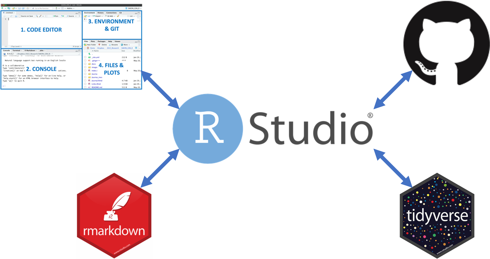

# Basics of R

This short workshop will introduce you to the basics of R and go over some fundamentals that you may have previously missed. 

It is aimed at R beginners, though many lessons will likely be useful to those who have been using R for several years with bad ingrained practices. 

### The four topics:

1. Installing R/RStudio and setting up your workspace

2. Version control

3. Reporting R workflows

4. Basics of data cleaning, manipulation & plotting

See the [links page](https://jdmwhite.github.io/SAEON_GSN_R/Links.html) for lots of helpful links on learning R.

